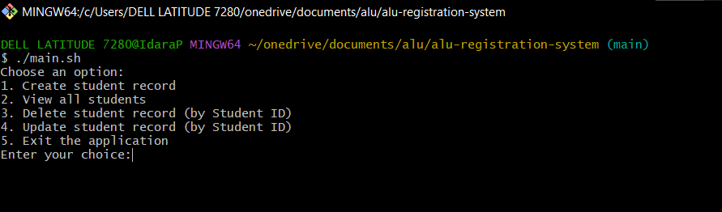
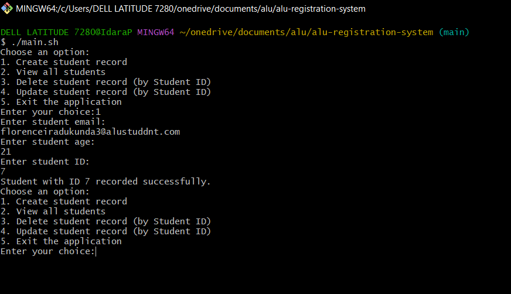
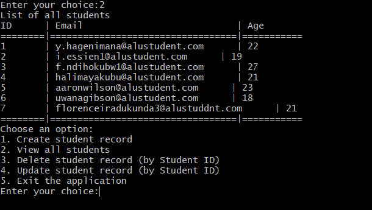
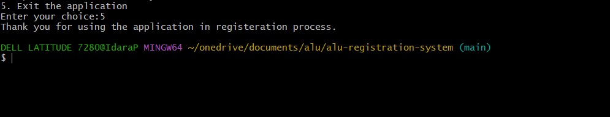

### An ALU registration system that takes the inputs of students pursuing a bachelors degree in software engineering and builds a cohort list.

#### Here are screenshots of how the application works

1. When the main.sh file runs
{width: 50% height: 60%}

2. Creating student records
{width: 50% height: 60%}
3. Viewing student records
{width: 50% height: 60%}
4. Exiting the application
{width: 50% height: 60%}
